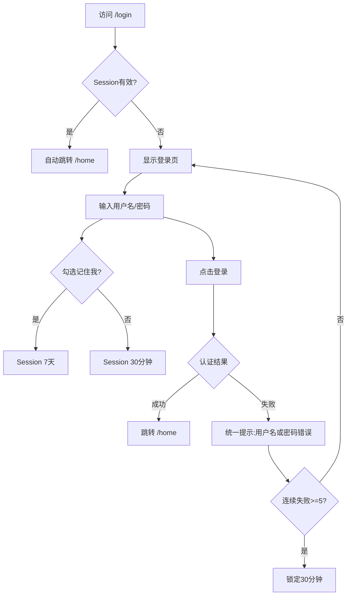

# 用户登录 测试设计文档

## 1. 测试目标
验证用户登录功能的各项需求：核心登录流程、参数校验、安全防护、会话管理，覆盖 Chrome/Firefox/Safari/Edge 及移动端浏览器。

## 2. 测试策略
- **用例总数：** 42
- **优先级分布：** P0: 8 / P1: 19 / P2: 15
- **测试方法：** 四步测试分析法

## 3. 需求分析与建模

### 3.1 业务流程图

### 3.2 等价类分析表

#### 3.2.1 用户名

| 条件 | 有效等价类 | 无效等价类 |
| :--- | :--- | :--- |
| 长度 4-20 | 4~20 位字符 | <4 位；>20 位 |
| 字符范围 | 字母、数字、下划线 | 特殊符号(@#$)；中文；空格 |
| 大小写 | 不区分(Match/mAtCh) | — |

#### 3.2.2 密码

| 条件 | 有效等价类 | 无效等价类 |
| :--- | :--- | :--- |
| 长度 6-20 | 6~20 位 | <6 位；>20 位 |
| 大写字母 | 至少1个 | 0个大写 |
| 小写字母 | 至少1个 | 0个小写 |
| 数字 | 至少1个 | 0个数字 |
| 组合 | 同时满足四项 | 仅满足部分 |

### 3.3 输入-输出表

| 用户名 | 密码 | 约束条件 | 预期输出 |
| :--- | :--- | :--- | :--- |
| admin | Admin123 | 有效用户名+有效密码 | 登录成功，跳转/home |
| admin | Admin1234 | 有效用户名+密码错误 | 登录失败，提示"用户名或密码错误" |
| admin | Admin123 | 账号已锁定(第6次尝试) | 登录失败，提示"账号已锁定，请30分钟后重试" |
| (空) | Admin123 | 用户名为空 | 提示"请输入用户名" |
| admin | (空) | 密码为空 | 提示"请输入密码" |

### 3.4 因子表

| 因子 | 水平1 | 水平2 | 水平3 |
| :--- | :--- | :--- | :--- |
| 记住我 | 勾选 | 不勾选 | — |
| Session状态 | 有效 | 过期 | 无 |
| 网络 | 正常 | HTTPS降级 | — |
| 浏览器 | Chrome | Firefox | Safari/Edge |

## 4. 测试用例列表

| 用例ID | 模块 | 测试层次 | 用例标题 | 前置条件 | 测试步骤 | 预期结果 | 优先级 | 用例类型 | 测试标签 | 关联测试点 |
| :--- | :--- | :--- | :--- | :--- | :--- | :--- | :--- | :--- | :--- | :--- |
| TC-FLOW-001 | 登录 | 系统测试 | 验证正确用户名和密码可成功登录 | 用户已注册且未锁定 | 1. 访问/login 2. 输入有效用户名 admin 3. 输入有效密码 Admin123 4. 点击登录按钮 | 登录成功，跳转至/home，页头显示用户名 | P0 | 功能 | 安全测试 | TP01 |
| TC-FLOW-002 | 登录 | 系统测试 | 验证错误密码登录失败且提示统一 | 用户已注册且未锁定 | 1. 访问/login 2. 输入有效用户名 3. 输入错误密码 4. 点击登录按钮 | 登录失败，提示"用户名或密码错误"，不透露密码是错的 | P0 | 功能 | 安全测试 | TP02 |
| TC-FLOW-003 | 登录 | 系统测试 | 验证连续5次错误密码后账号锁定 | 账号未锁定，错误次数=0 | 1-4: 重复5次输入错误密码并登录 5. 输入正确密码 6. 点击登录 | 第5次后提示"账号已锁定，请30分钟后重试"，正确密码也无法登录 | P0 | 功能 | 安全测试 | TP04 |
| TC-FLOW-004 | 登录 | 系统测试 | 验证锁定30分钟后自动解锁 | 账号已锁定，已过30分钟 | 1. 等待30分钟 2. 输入正确密码 3. 点击登录 | 登录成功，跳转至/home | P1 | 功能 | — | TP05 |
| TC-FLOW-005 | 登录 | 系统测试 | 验证已登录用户访问/login自动跳转 | 用户已成功登录，Session有效 | 1. 在浏览器地址栏输入/login 2. 回车 | 自动跳转至/home，无需重新输入密码 | P0 | 功能 | — | TP07 |
| TC-FLOW-006 | 登录 | 系统测试 | 验证Session过期后访问/login不跳转 | Session已过期(超过30分钟) | 1. 在浏览器地址栏输入/login 2. 回车 | 显示登录页，不跳转 | P1 | 功能 | — | TP08 |
| TC-FLOW-007 | 登录 | 系统测试 | 验证勾选记住我后Session有效期7天 | 无有效Session | 1. 输入正确用户名密码 2. 勾选"记住我" 3. 点击登录 4. 关闭浏览器 5. 7天内重新打开并访问/login | 自动跳转/home，无需重新登录 | P0 | 功能 | — | TP09 |
| TC-FLOW-008 | 登录 | 系统测试 | 验证不勾选记住我时Session有效期30分钟 | 无有效Session | 1. 输入正确用户名密码 2. 不勾选"记住我" 3. 点击登录 4. 等待31分钟 5. 访问/home | 跳转到/login，提示需要重新登录 | P1 | 功能 | — | TP10 |
| TC-PARAM-001 | 登录 | 系统测试 | 验证用户名为空时的错误提示 | 位于登录页 | 1. 用户名留空 2. 输入有效密码 3. 点击登录 | 提示"请输入用户名" | P1 | 负向 | — | TP11 |
| TC-PARAM-002 | 登录 | 系统测试 | 验证密码为空时的错误提示 | 位于登录页 | 1. 输入有效用户名 2. 密码留空 3. 点击登录 | 提示"请输入密码" | P1 | 负向 | — | TP12 |
| TC-DATA-001 | 登录 | 系统测试 | 验证用户名小于4位时的错误提示 | 位于登录页 | 1. 用户名输入 abc(3位) 2. 输入有效密码 3. 点击登录 | 提示"用户名或密码错误" | P2 | 负向 | — | TP13 |
| TC-DATA-002 | 登录 | 系统测试 | 验证用户名超过20位时的错误提示 | 位于登录页 | 1. 用户名输入21位有效字符 2. 输入有效密码 3. 点击登录 | 提示"用户名或密码错误" | P2 | 负向 | — | TP14 |
| TC-DATA-003 | 登录 | 系统测试 | 验证用户名包含特殊字符时的处理 | 位于登录页 | 1. 用户名输入 admin@#$ 2. 输入有效密码 3. 点击登录 | 提示"用户名或密码错误" | P2 | 负向 | — | TP15 |
| TC-DATA-004 | 登录 | 系统测试 | 验证密码长度小于6位时的错误提示 | 位于登录页 | 1. 输入有效用户名 2. 密码输入 Abc12(5位) 3. 点击登录 | 提示"用户名或密码错误" | P2 | 负向 | — | TP16 |
| TC-DATA-005 | 登录 | 系统测试 | 验证密码长度超过20位时的错误提示 | 位于登录页 | 1. 输入有效用户名 2. 密码输入21位 | 提示"用户名或密码错误" | P2 | 负向 | — | TP17 |
| TC-DATA-006 | 登录 | 系统测试 | 验证密码不含大写字母时的处理 | 位于登录页 | 1. 输入有效用户名 2. 密码输入 admin123(无大写) 3. 点击登录 | 提示"用户名或密码错误" | P2 | 负向 | — | TP18 |
| TC-DATA-007 | 登录 | 系统测试 | 验证密码不含小写字母时的处理 | 位于登录页 | 1. 输入有效用户名 2. 密码输入 ADMIN123(无小写) 3. 点击登录 | 提示"用户名或密码错误" | P2 | 负向 | — | TP19 |
| TC-DATA-008 | 登录 | 系统测试 | 验证密码不含数字时的处理 | 位于登录页 | 1. 输入有效用户名 2. 密码输入 AdminAbc(无数字) 3. 点击登录 | 提示"用户名或密码错误" | P2 | 负向 | — | TP20 |
| TC-FLOW-009 | 登录 | 系统测试 | 验证大小写不敏感的登录 | 用户已注册 admin | 1. 用户名输入 Admin 2. 输入正确密码 3. 点击登录 | 登录成功，跳转至/home | P0 | 功能 | — | TP21 |
| TC-FLOW-010 | 登录 | 系统测试 | 验证非注册用户登录的提示 | 用户名 unregistered 不存在 | 1. 输入不存在的用户名 2. 输入任意密码 3. 点击登录 | 提示"用户名或密码错误" | P1 | 负向 | — | TP03 |
| TC-EXT-001 | 登录 | 系统测试 | 验证SQL注入防护 | 位于登录页 | 1. 用户名输入 ' OR '1'='1 2. 密码输入 ' OR '1'='1 3. 点击登录 | 提示"用户名或密码错误"，数据库无异常 | P0 | 安全 | 安全测试 | TP22 |
| TC-EXT-002 | 登录 | 系统测试 | 验证XSS攻击防护 | 位于登录页 | 1. 用户名输入 `` 2. 密码输入 Admin123 3. 点击登录 | 页面不弹窗，内容被转义或过滤 | P0 | 安全 | 安全测试 | TP23 |
| TC-EXT-003 | 登录 | 系统测试 | 验证HTTPS传输加密 | 网络可抓包 | 1. 使用HTTP访问/login 2. 尝试登录 | 请求自动重定向到HTTPS，密码明文不在HTTP中传输 | P1 | 安全 | 安全测试 | TP24 |
| TC-EXT-004 | 登录 | 系统测试 | 验证Token存储在HttpOnly Cookie | 用户已成功登录 | 1. 打开浏览器开发者工具 2. 查看Cookies 3. 用JS读取document.cookie | Cookie中无JWT Token，HttpOnly标记为true | P1 | 安全 | 安全测试 | TP25 |
| TC-FLOW-011 | 登录 | 系统测试 | 验证暴力破解防护(锁定前4次) | 账号未锁定 | 1-4. 连续4次输入错误密码 5. 输入正确密码 6. 点击登录 | 第5次(正确密码)登录成功 | P1 | 功能 | 安全测试 | TP06 |
